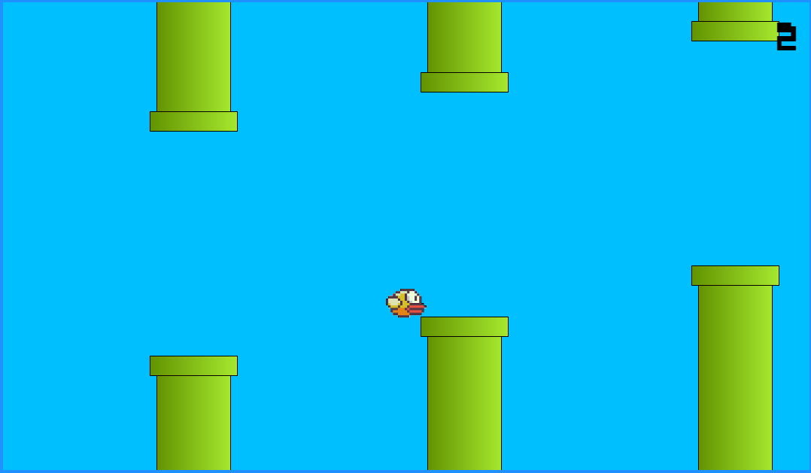

# Flappy Bird Simulator

## Objetivo
Este repositório tem como objetivo o desenvolvimento de uma simulação do jogo Flappy Bird, realizado de acordo com o curso de Web Moderno da plataforma Udemy.

## Como executar
Para executar o jogo, é necessário abrir o arquivo flappy.html no navegador utilizando um servidor local (como o live server) pelo Visual Studio Code.

## Como jogar
Pressionar alguma tecla irá aumentar a altura de voo do pássaro, enquanto não pressionar nenhuma tecla irá diminuir a altura de voo do pássaro.
O objetivo é passar entre o maior número de barreiras possível. Caso perca, atualize a página para reiniciar o jogo.   

